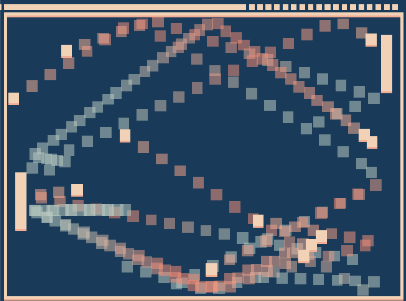

# Pong but fair

Author: Woody McCoy

Design: It's like pong, but the player can introduce new balls whenever they would like. To compensate, the AI has been slightly improved.

Screen Shot:

How To Play:

Move your mouse to control the position of your paddle on screen. Press space to launch a new ball!

Sources: N/A

This game was built with [NEST](NEST.md).
